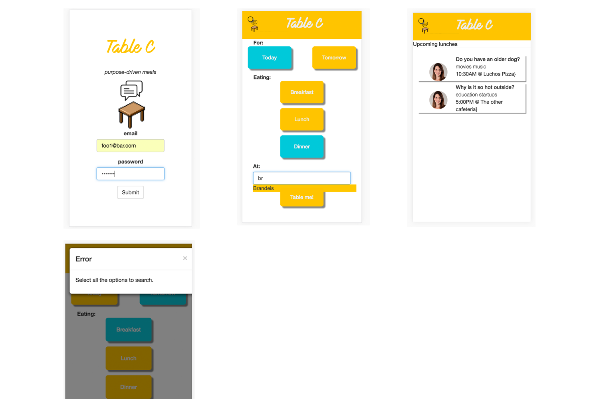

#Table_c

## Inspiration
At any community dining venues, the phenomenon of people eating alone reluctantly is ubiquitous. Most people slowly enter into the tables and takes a full look of the place, looking for people to eat with. Unfortunately, there are almost always the failure cases. Habits of eating alone reluctantly leads to loneliness and depression, feeling disconnected to the community. In addition, it's hard to meet new people who share similar interest over a regular meal within a sizable community.

## What it does
TableC creates "purpose driven meals", connecting you to new friends by matching meal buddies with topics of shared interest. For anybody who does not want to eat alone and wants to meet a new friend, TableC curates various conversation topics for a specific meal of a day at a specific location. Akin to entering into an online game server/room, the app lets you either create or join meal conversation topics to eat with like-minded people, have great conversations, with great new friends.

## How we built it
Within 24 hours, we built the fully-designed mock-up, along with our prototype that's built with Angular2 and Ruby on Rails.

## Challenges we ran into
Deploying all the functions including automatic location recognition and setting "nearby distance" function.

## Accomplishments that we're proud of
We built a working prototype with limited time and resources.

## What we learned
What started as an idea can be visualized and put into a working prototype in 24 hours.

## What's next for TableC
Developing our prototype further and testing it to college market in both technical and non-technical way.